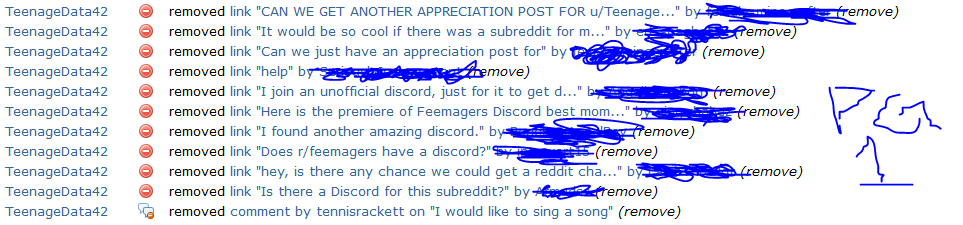
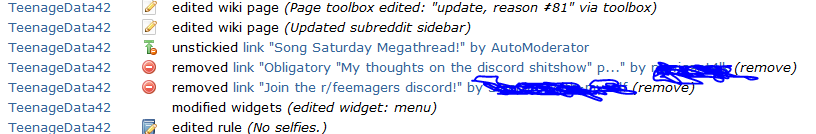
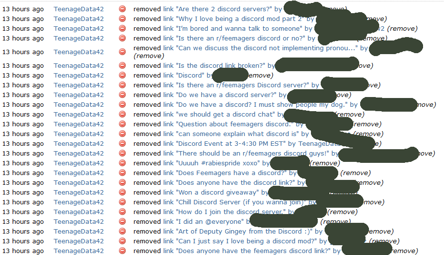
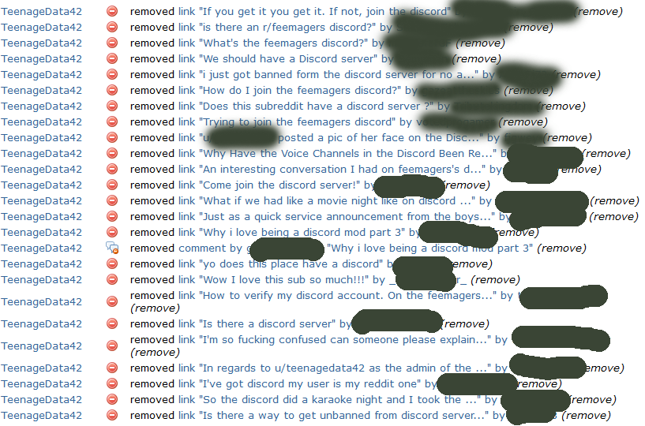
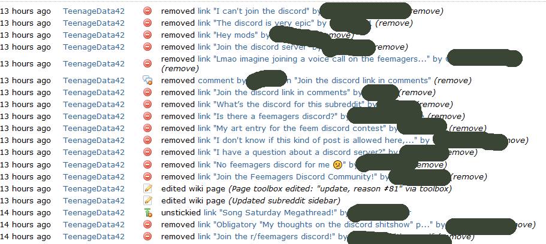
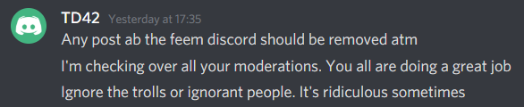
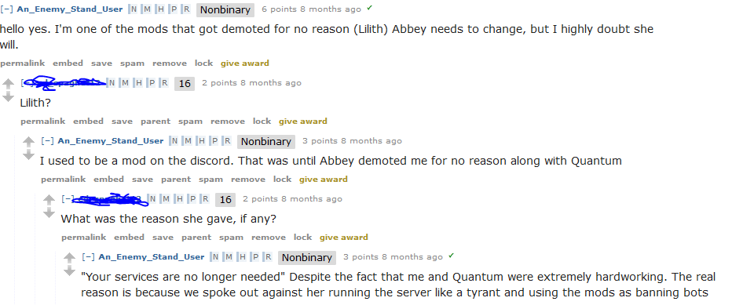

Well.

As you may know, the reddit community of /r/feemagers (a community designed to be an alternative to /r/teenagers, specifically focused on the "purpose of teenage girls embracing their womanhood and raging hormones. "[from the sub's sidebar.])

Recently, the owner of /r/feemagers, /u/TeenageData42, hereafter TD42, had a... falling out with the users and admins of the discord server. This culminated in her resigning her role as discord owner. As of 5:00 UTC, May 24th, 2020, she has removed all mention of the discord server inside the subreddit. This includes comments, links, and user flairs.

This is a single page of the mod log.  There are 4 pages that look like this.

<!-- -     - -->

Here she is telling the mods to remove all posts about the discord server. 

[Here's a link to a document made, calling out TD42.](https://docs.google.com/document/d/1ca2Vak7JmK3r0Tbo3-6TOvYyQO8KIbrkKMIUcQOeuP0/edit?usp=sharing)

[Here's another link, to yet another document made, again calling her out.](https://docs.google.com/document/d/1AxZY4_-xghVf9avJxU7bZmGUfCbVzVGJ8ZqqEBg9C40/edit?usp=sharing)

Both of these are long pages, and I understand that most people won't read them. However, here's a couple of sentences that really sum it all up.

`The first and probably largest fallout was the Split, involving [a now ex- head mod], alongside several other moderators leaving the server due to a perceived lack of communication between [TD42] actions and the rest of the moderation team, leading to them creating an offshoot server, Teamagers. This event would also lead to [TD42] banning several of her users out of fear of disloyalty. After this she soon replaced the void with a group of new trial moderators, whom she also continued this behavior towards, treating them poorly, taking on an attitude of superiority and general cruelty that should not exist amongst staff members. [TD42] would then go to write a quiz with the intention of maliciously mocking one of the trial moderators mistakes, which led to him isolating a suicidal user. This would then be followed by her scapegoating the trial moderator in front of the entire server slandering their name unfairly. This action was done impulsively and in disagreement with the rest of the staff team[.]`

Here's a quote from my DMs with an ex mod, Quantum, mentioned in the above documents. `"I wake up 5 hours later. She dmed me. "Your services are no longer required as moderator". She sent this 15mjnjtes(sic) before I woke up. I was sick to my stomach. I believe lilith received the same fate. All that and she turns around and punched me in the gut. To this day she hasn't replied to my dms. "`

Here's a picture of her removing mentions of the discord in official subreddit things, such as the sidebar.

Here's an ex-discord mod talking about the _last_ time this happened, 8 months ago. 

Here's a portion of the goodbye note from an ex head mod: `"Abbey has just stood way out of order of what both [other head mod, also stepped down] and I are comfortable with. She has been dishing out executive decisions and ignoring what we and all the other admins have to say. She added disboard despite us expressing how horrible the users who come from it can be. Doxxing some of our personal information. Delaying key server progressions and improvements, just because she said so. But the one kicker for me is, and I quote: "He left at such an inconvenient time" in regards to me leaving to spend my final weeks and days with my terminally ill best friend I'm done with her, and I'm done with modding for people who don't listen to me."`

Here is a section of TD42's goodbye letter: `I am not a villain. And for those who think as much, I'm sorry that you have seen me in that light. I apologize for all the havoc I've caused. I regret a lot of stuff, but there's also some stuff I don't regret: like creating this server.`

No matter what way you look at this, this is pretty damn villainous.

[Here's the feemagers discord server.](https://discord.gg/ZXR9b7f)

mod discord server: <https://discord.gg/DGKR9xN>

**Be careful, despots of discord servers around the world. I see a new day coming. A new day, where we inspire a change, as the age of new peoples rises up to choose their fate, striking down the rulers of old with the hammers of justice, the echo thundering across the earth, ushering in a new age. Down with TD42!**
